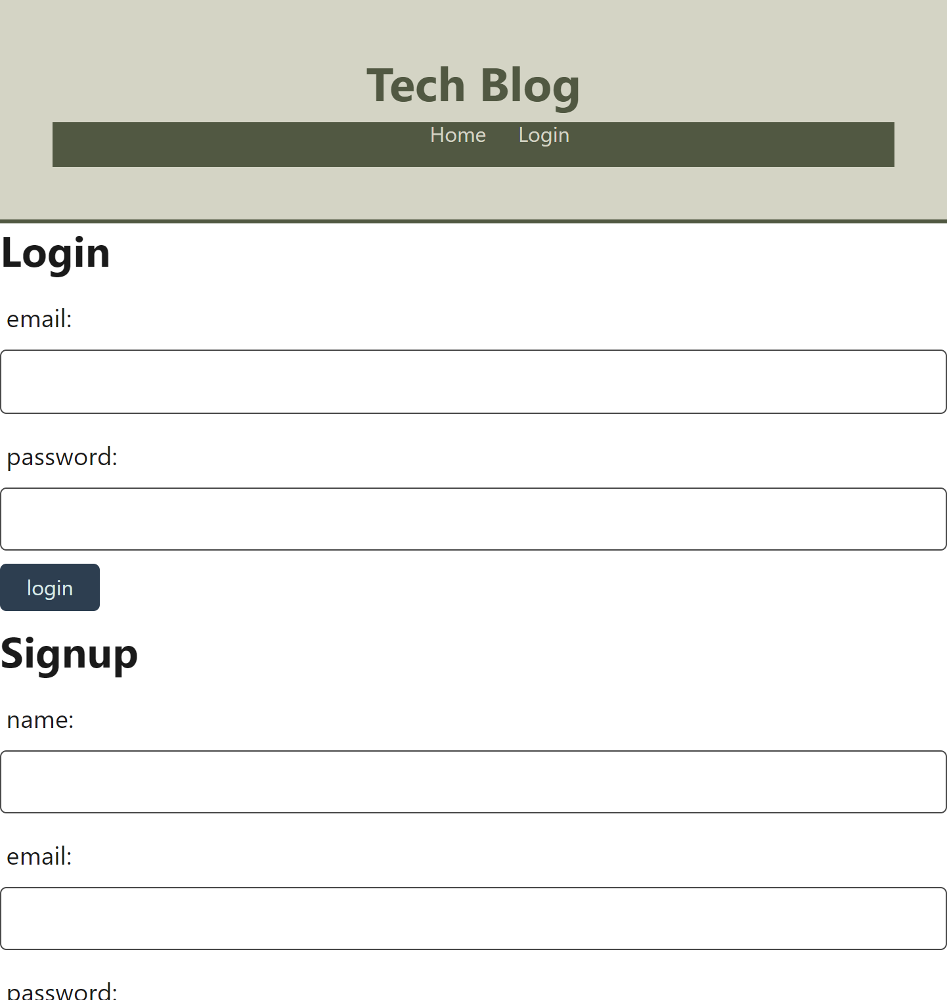

# tech-blog

## Description

Read, create and delete blog posts, and comment on other users posts

## Table of Contents

[Installation](#installation)  
 [Usage](#usage)  
 [Contribution](#contribution)  
 [License](#license)  
 [Tests](#tests)  
 [Questions](#questions)

## Installation

No installation is required, just visit the URL below.

## Usage

Navigate to: [https://taking-notes.herokuapp.com/](https://tranquil-ocean-01522.herokuapp.com/login) and login or create an account

## Contributing

Any contribution suggestions are welcome.

## Tests

N/A

## Questions

Wir3s  
 [GitHub Profile](https://github.com/Wir3s)  
 Email me at aandrebess@gmail.com with any additional questions.

## License

This project is using the MIT license.

Copyright (c) 2023 Wir3s

Permission is hereby granted, free of charge, to any person obtaining a copy of this software and associated documentation files (the "Software"), to deal in the Software without restriction, including without limitation the rights to use, copy, modify, merge, publish, distribute, sublicense, and/or sell copies of the Software, and to permit persons to whom the Software is furnished to do so, subject to the following conditions:

The above copyright notice and this permission notice shall be included in all copies or substantial portions of the Software.

THE SOFTWARE IS PROVIDED "AS IS", WITHOUT WARRANTY OF ANY KIND, EXPRESS OR IMPLIED, INCLUDING BUT NOT LIMITED TO THE WARRANTIES OF MERCHANTABILITY, FITNESS FOR A PARTICULAR PURPOSE AND NONINFRINGEMENT. IN NO EVENT SHALL THE AUTHORS OR COPYRIGHT HOLDERS BE LIABLE FOR ANY CLAIM, DAMAGES OR OTHER LIABILITY, WHETHER IN AN ACTION OF CONTRACT, TORT OR OTHERWISE, ARISING FROM, OUT OF OR IN CONNECTION WITH THE SOFTWARE OR THE USE OR OTHER DEALINGS IN THE SOFTWARE.
